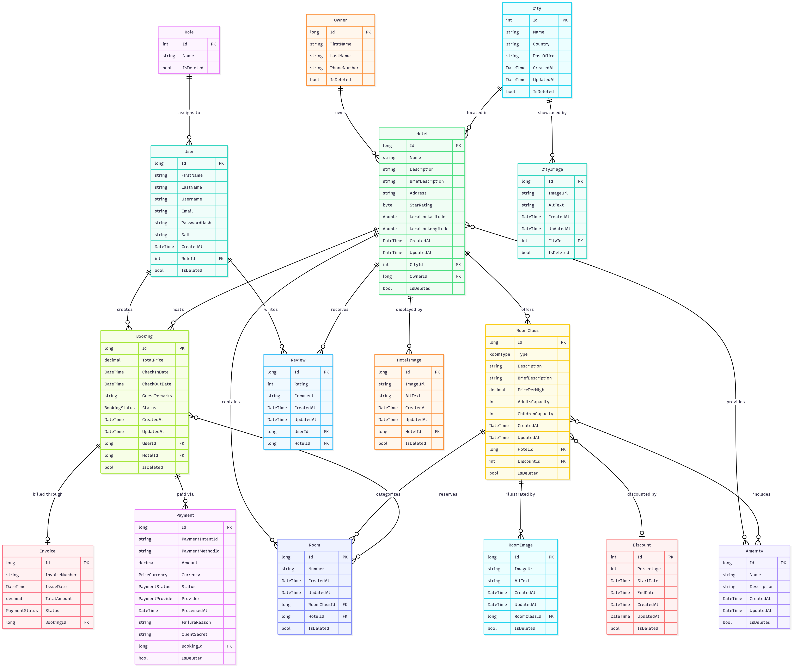

# Travel and Accommodation Booking Platform API (TABP)

[](https://github.com/alaahewwari/Travel-and-Accommodation-Booking-Platform/actions/workflows/test.yml)

  [](https://codecov.io/gh/alaahewwari/Travel-and-Accommodation-Booking-Platform)

  [](https://github.com/alaahewwari/Travel-and-Accommodation-Booking-Platform/actions/workflows/development_tabp-app.yml)
## 🏨 Project Overview

This is a web API that helps manage hotel bookings, user accounts, payments, and more. It's made to support both guests and admins with all the tools needed for a hotel booking system.

## ✨ API Features

### 🔐 Authentication & Authorization APIs
- JWT-based authentication endpoints
- Role-based access control (RBAC)
- User registration and login APIs
- Secure token management

### 🏩 Hotel Management APIs
- Complete hotel CRUD operations
- Room class management with amenities
- Image upload endpoints for thumbnails and galleries
- Featured deals and trending destinations APIs
- Advanced search with filtering capabilities

### 📅 Booking System APIs
- Real-time room availability checking
- Secure checkout process with Stripe integration
- 3D Secure payment support
- Booking confirmation with PDF invoice generation
- Email notification services

### 💳 Payment Processing APIs
- Stripe payment integration endpoints
- Support for multiple payment methods
- Secure payment confirmation flow

### 👨‍💼 Admin Management APIs
- Administrative endpoints for managing:
  - Cities, Hotels, and Rooms
  - User accounts and roles
  - Bookings and payments
  - Amenities and discounts

## 🏗️ Backend Architecture

### Clean Architecture Implementation
```
├── TABP.API/              # Web API Layer (Controllers, Middleware)
├── TABP.Application/      # Application Layer (CQRS + MediatR)
├── TABP.Domain/          # Domain Layer (Entities, Enums, Interfaces)
├── TABP.Infrastructure/  # Infrastructure Layer (External Services)
└── TABP.Persistence/     # Data Access Layer (EF Core)
```

### API Design Patterns
- **RESTful API Design** with proper HTTP status codes
- **CQRS** with MediatR for request handling
- **Repository Pattern** for data access
- **Unit of Work** for transaction management
- **Result Pattern** for consistent error handling
- **Clean Architecture** principles
- **Dependency Injection** throughout all layers

### API Features
- **Swagger/OpenAPI** documentation (development)
- **JWT Bearer Authentication** 
- **CORS** configuration for frontend integration
- **Request/Response logging**
- **Global exception handling**
- **Model validation** with FluentValidation
- **Pagination** support for list endpoints

## 🚀 Getting Started

### Prerequisites
- .NET 9 SDK
- SQL Server (LocalDB or full instance)
- Stripe Account (for payment processing)

### Installation

1. **Clone the repository**
   ```bash
   git clone https://github.com/alaahewwari/Travel-and-Accommodation-Booking-Platform.git
   cd TABP
   ```

2. **Restore dependencies**
   ```bash
   dotnet restore
   ```

3. **Configure app settings**
   ```json
   {
     "ConnectionStrings": {
       "DefaultConnection": "<connection_string>"
     },
     "StripeSettings": {
       "SecretKey": "sk_test_your_stripe_secret_key",
       "PublishableKey": "pk_test_your_stripe_publishable_key"
     },
     "JwtSettings": {
       "Secret": "your-jwt-secret-key-here",
       "Issuer": "TABP",
       "Audience": "TABP-Users",
       "ExpiryMinutes": 60
     }
   }
   ```

4. **Run database migrations**
   ```bash
   dotnet ef database update
   ```

5. **Start the API server**
   ```bash
   dotnet run --project TABP.API
   ```

## 📚 API Documentation

### Base URL

```
Development: https://localhost:7120
```

(Note: all endpoints are prefixed with `/api`)

---

### 🔐 Authentication Endpoints

| Method | Endpoint                    | Description                          | Auth Required |
| ------ | --------------------------- | ------------------------------------ | ------------- |
| `POST` | `/api/authentication/login` | Authenticate user (obtain JWT token) | ❌             |

**Login Response Example:**

```json
{
  "token": "eyJhbGciOiJIUzI1NiIsInR5cCI6IkpXVCJ9..."
}
```

---

### 👥 User Management Endpoints

| Method | Endpoint     | Description               | Auth Required |
| ------ | ------------ | ------------------------- | ------------- |
| `POST` | `/api/users` | Register new user account | ❌             |

---

### 🏙️ City Management Endpoints

| Method   | Endpoint                     | Description                     | Auth Required |
| -------- | ---------------------------- | ------------------------------- | ------------- |
| `GET`    | `/api/cities`                | Get all cities                  | ❌             |
| `GET`    | `/api/cities/{id}`           | Get specific city by ID         | ❌             |
| `POST`   | `/api/cities`                | Create new city                 | ✅ Admin       |
| `PUT`    | `/api/cities/{id}`           | Update city information         | ✅ Admin       |
| `DELETE` | `/api/cities/{id}`           | Delete city                     | ✅ Admin       |
| `GET`    | `/api/cities/trending`       | Get trending/popular cities     | ❌             |
| `POST`   | `/api/cities/{id}/thumbnail` | Upload or update city thumbnail | ✅ Admin       |

---

### 🏠 Owner Management Endpoints

| Method   | Endpoint           | Description              | Auth Required |
| -------- | ------------------ | ------------------------ | ------------- |
| `GET`    | `/api/owners/{id}` | Get owner by ID          | ✅ Admin       |
| `POST`   | `/api/owners`      | Create new owner         | ✅ Admin       |
| `PUT`    | `/api/owners/{id}` | Update owner information | ✅ Admin       |
| `DELETE` | `/api/owners/{id}` | Delete owner             | ✅ Admin       |

---

### 🏨 Hotel Management Endpoints

| Method   | Endpoint                     | Description                              | Auth Required |
| -------- | ---------------------------- | ---------------------------------------- | ------------- |
| `GET`    | `/api/hotels`                | Get all hotels                           | ❌             |
| `GET`    | `/api/hotels/{id}`           | Get hotel details by ID                  | ❌             |
| `POST`   | `/api/hotels`                | Create new hotel                         | ✅ Admin       |
| `PUT`    | `/api/hotels/{id}`           | Update hotel                             | ✅ Admin       |
| `DELETE` | `/api/hotels/{id}`           | Delete hotel                             | ✅ Admin       |
| `GET`    | `/api/hotels/search`         | Search hotels with filter and pagination | ❌             |
| `GET`    | `/api/hotels/featured-deals` | Get featured hotel deals                 | ❌             |
| `POST`   | `/api/hotels/{id}/thumbnail` | Upload hotel thumbnail image             | ✅ Admin       |
| `POST`   | `/api/hotels/{id}/gallery`   | Add image to hotel gallery               | ✅ Admin       |

---

### 🏨 Booking System Endpoints

| Method  | Endpoint                         | Description                                    | Auth Required  |
| ------- | -------------------------------- | ---------------------------------------------- | -------------- |
| `POST`  | `/api/bookings`                  | Create new booking                             | ✅ Guest        |
| `GET`   | `/api/bookings`                  | Get all bookings (guest's own or all by admin) | ✅ Guest, Admin |
| `GET`   | `/api/bookings/{id}`             | Get booking details by ID                      | ✅ Guest        |
| `PATCH` | `/api/bookings/{id}`             | Cancel existing booking                        | ✅ Guest        |
| `POST`  | `/api/bookings/confirm-payment`  | Confirm payment after 3D‑Secure                | ✅ Guest        |
| `GET`   | `/api/bookings/{id}/invoice.pdf` | Download booking invoice (PDF)                 | ✅ Guest        |

**Booking Creation Request Example:**

```json
{
  "hotelId": 1,
  "roomIds": [ 101, 102 ],
  "checkInDate": "2025-08-10T14:00:00Z",
  "checkOutDate": "2025-08-12T11:00:00Z",
  "guestRemarks": "Late arrival expected",
  "paymentMethodId": "pm_card_visa"
}
```
### 📝 Reviews Management Endpoints

| Method   | Endpoint              | Description              | Auth Required  |
| -------- | --------------------- | ------------------------ | -------------- |
| `POST`   | `/api/reviews`        | Create new review        | ✅ Guest        |
| `GET`    | `/api/reviews/{id}`   | Get review details by ID | ❌              |
| `PUT`    | `/api/reviews/{id}`   | Update existing review   | ✅ Guest        |
| `DELETE` | `/api/reviews/{id}`   | Delete review            | ✅ Guest, Admin |

### 🛏️ Room Class & Room Endpoints

| Method   | Endpoint                          | Description                         | Auth Required |
| -------- | --------------------------------- | ----------------------------------- | ------------- |
| `GET`    | `/api/roomclasses`                | Get all room class types            | ❌             |
| `GET`    | `/api/roomclasses/{id}`           | Get room class details by ID        | ❌             |
| `POST`   | `/api/roomclasses`                | Create new room class               | ✅ Admin       |
| `PUT`    | `/api/roomclasses/{id}`           | Update room class                   | ✅ Admin       |
| `DELETE` | `/api/roomclasses/{id}`           | Delete room class                   | ✅ Admin       |
| `POST`   | `/api/roomclasses/{id}/thumbnail` | Upload room class thumbnail         | ✅ Admin       |
| `POST`   | `/api/roomclasses/{id}/gallery`   | Add image to room class gallery     | ✅ Admin       |
| `POST`   | `/api/roomclasses/{id}/amenities` | Assign amenity to room class        | ✅ Admin       |
| `GET`    | `/api/roomclasses/{id}/discounts` | Get active discounts for room class | ❌             |
| `GET`    | `/api/rooms`                      | Get all rooms                       | ❌             |
| `GET`    | `/api/rooms/{id}`                 | Get room details by ID              | ❌             |
| `POST`   | `/api/rooms`                      | Create new room                     | ✅ Admin       |
| `PUT`    | `/api/rooms/{id}`                 | Update room                         | ✅ Admin       |
| `DELETE` | `/api/rooms/{id}`                 | Delete room                         | ✅ Admin       |

---

### 💰 Discount Management Endpoints

| Method   | Endpoint              | Description                | Auth Required |
| -------- | --------------------- | -------------------------- | ------------- |
| `POST`   | `/api/discounts`      | Add discount to room class | ✅ Admin       |
| `DELETE` | `/api/discounts/{id}` | Remove discount            | ✅ Admin       |

---

### 🏷️ User Role Management Endpoints

| Method   | Endpoint          | Description            | Auth Required |
| -------- | ----------------- | ---------------------- | ------------- |
| `GET`    | `/api/roles`      | Get all user roles     | ✅ Admin       |
| `GET`    | `/api/roles/{id}` | Get role details by ID | ✅ Admin       |
| `POST`   | `/api/roles`      | Create new role        | ✅ Admin       |
| `PUT`    | `/api/roles/{id}` | Update role            | ✅ Admin       |
| `DELETE` | `/api/roles/{id}` | Delete role            | ✅ Admin       |

---

### 🎯 Amenity Management Endpoints

| Method | Endpoint              | Description               | Auth Required |
| ------ | --------------------- | ------------------------- | ------------- |
| `GET`  | `/api/amenities`      | Get all amenities         | ❌             |
| `GET`  | `/api/amenities/{id}` | Get amenity details by ID | ❌             |
| `POST` | `/api/amenities`      | Create new amenity        | ✅ Admin       |
| `PUT`  | `/api/amenities/{id}` | Update amenity            | ✅ Admin       |

---

### ❌ Error Response Format

All API endpoints return consistent error responses:

```json
{
  "code": "Resource.NotFound",
  "description": "Detailed error description."
}
```
### 📄 Common Response Codes
| Code | Description |
|------|-------------|
| `200` | Success |
| `201` | Created successfully |
| `204` | No content (successful deletion) |
| `400` | Bad request (validation errors) |
| `401` | Unauthorized (missing/invalid token) |
| `403` | Forbidden (insufficient permissions) |
| `404` | Resource not found |
| `500` | Internal server error |

## 🧪 Testing

### Run Unit Tests
```bash
dotnet test TABP.Application.Tests
```

### Run Integration Tests
```bash
dotnet test Application.IntegrationTests
```

### Test Coverage
The project includes comprehensive unit and integration tests covering:
- Application layer business logic
- API controllers
- Repository implementations
- Payment processing flows

## 🔄 CI/CD Pipeline

The project includes GitHub Actions workflows:

- **`ci-tests.yml`**: Runs unit tests on development branch
- **`deploy-azure.yml`**: Deploys to Azure (production)

### Workflow Configuration
```yaml
# Triggers on development branch
on:
  push:
    branches: [ "development" ]
  pull_request:
    branches: [ "development" ]
```

## 🛡️ Security Features

- **JWT Authentication**: Secure token-based authentication
- **Password Hashing**: BCrypt for password security
- **HTTPS Only**: Enforced HTTPS in production
- **Input Validation**: Comprehensive request validation
- **SQL Injection Protection**: Entity Framework parameterized queries
- **CORS Configuration**: Properly configured cross-origin requests

## 💾 Database Schema

### Entity Relationship Diagram



### Core Entities

#### User Management
* **User**: Customer profiles for authentication and booking management. Contains personal information, credentials (hashed password + salt), and role assignments.
* **Role**: Permission-based access control defining user capabilities (Guest, Admin, SuperAdmin).
* **Owner**: Hotel proprietor profiles managing property portfolios with contact information.

#### Location & Property Management
* **City**: Geographic destinations with country and postal information for location-based searches and trending analysis.
* **Hotel**: Accommodation properties with detailed information including location coordinates, star ratings, and administrative details.
* **RoomClass**: Room type templates defining categories (Single, Double, Suite) with pricing, capacity specifications, and amenity associations.
* **Room**: Individual physical room instances with unique identifiers, linked to room classes for availability management.

#### Booking & Financial Management
* **Booking**: Customer reservations linking users to hotels and rooms with date ranges, pricing, and status tracking.
* **Payment**: Secure payment transaction records with Stripe integration, supporting multiple payment methods and 3D Secure.
* **Invoice**: Formal billing documents with unique invoice numbers for accounting and customer records.

#### Content & Enhancement
* **Review**: Customer feedback system with ratings and comments for hotels, enabling quality assessment and marketing.
* **Amenity**: Reusable feature definitions (WiFi, Pool, Gym, Parking) applicable to both hotels and specific room classes.
* **Discount**: Time-based promotional pricing rules with percentage reductions applicable to room classes.

#### Media Management
* **CityImage**: Destination marketing imagery with accessibility support (alt text) for city promotion.
* **HotelImage**: Property visual content including exterior, interior, and facility photographs.
* **RoomImage**: Room-specific imagery showcasing different room class types and layouts.

###Key Features

* **Soft Delete**: Entities are marked as deleted, not permanently removed
* **Audit Trails**: All entities track creation and update timestamps
* **Multi-Currency**: Payment support for different currencies
* **Image Management**: Comprehensive photo galleries for cities, hotels, and rooms


### Authentication Flow
1. **Register/Login** → Get JWT token
2. **Include token** in Authorization header: `Bearer {token}`
3. **Access protected endpoints**

## 🤝 Contributing

1. Fork the repository
2. Create a feature branch (`git checkout -b feature/amazing-feature`)
3. Commit your changes (`git commit -m 'Add amazing feature'`)
4. Push to the branch (`git push origin feature/amazing-feature`)
5. Open a Pull Request

## 🔧 Development Tools

- **IDE**: Visual Studio 2022
- **Database**: SQL Server Management Studio
- **API Testing**: Postman / Swagger UI
- **Version Control**: Git with GitHub
- **Project Management**: Jira

## 👨‍💻 Author

**Alaa Hewwari**
- GitHub: [@alaahewwari](https://github.com/alaahewwari)
- Email: alaahewwari@gmail.com

---

⭐ **Star this repository if you found it helpful!**
